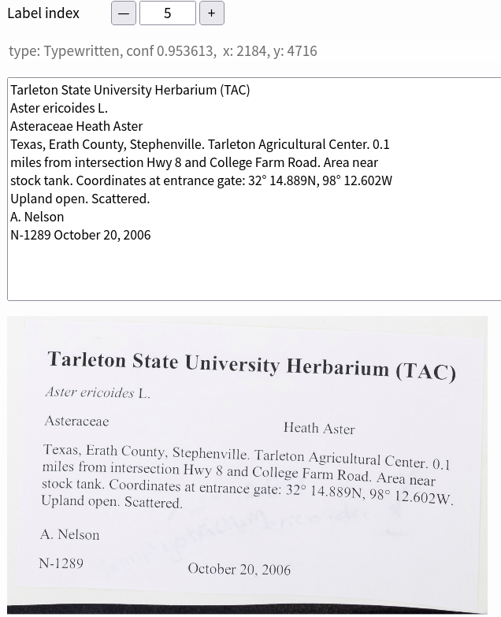

# ocr_ensemble

OCR herbarium labels with an ensemble of image processing techniques and OCR engines.
After you have each label in its own image file, you can extract the text from the labels using OCR. We have found that using an ensemble of OCR engines and image processing techniques works better in most cases than just OCR alone.

Image processing techniques:

1. Do nothing to the image. This works best with clean new herbarium sheets.
2. We slightly blur the image, scale it to a size that works with many OCR images, orient the image to get it rightside up, and then deskew the image to finetune its orientation.
3. We perform all the steps in #2 and additionally perform a Sauvola (Sauvola & Pietikainen, 2000) binarization of the image, which often helps improve OCR results.
4. We do all the steps in #3, then remove “snow” (image speckles) and fill in any small “holes” in the binarized image.

OCR engines:

1. Tesseract OCR (Smith 2007).
2. EasyOCR (https://github.com/JaidedAI/EasyOCR).

Therefore, there are 8 possible combinations of image processing and OCR engines. We found, by scoring against a gold standard, that using all 8 combinations does not always yield the best results. Currently, we use 6/8 combinations with binarize/EasyOCR and denoise/EasyOCR deemed unhelpful.

After the image processing & OCR combinations we then:

1. Perform minor edits to fix some common OCR errors like the addition of spaces before punctuation or common character substitutions.
2. Next we find the Levenshtein distance for all pairs of text sequences and remove any sequence that has a Levenshtein score greater than a predetermined cutoff (128) from the best Levenshtein score.
3. The next step in the workflow is to use a Multiple Sequence Alignment (MSA) algorithm that is directly analogous to the ones used for biological sequences but instead of using a PAM or BLOSUM substitution matrix we use a visual similarity matrix. Exact visual similarity depends on the font so an exact distance is not feasible. Instead we use a rough similarity score that ranges from +2, for characters that are identical, to -2, where the characters are wildly different like a period and a W. We also used a gap penalty of -3 and a gap extension penalty of -0.5.
4. Finally, we edit the MSA consensus sequence with a spell checker, add or remove spaces within words, and fix common character substitutions.
