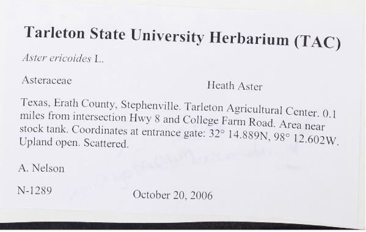
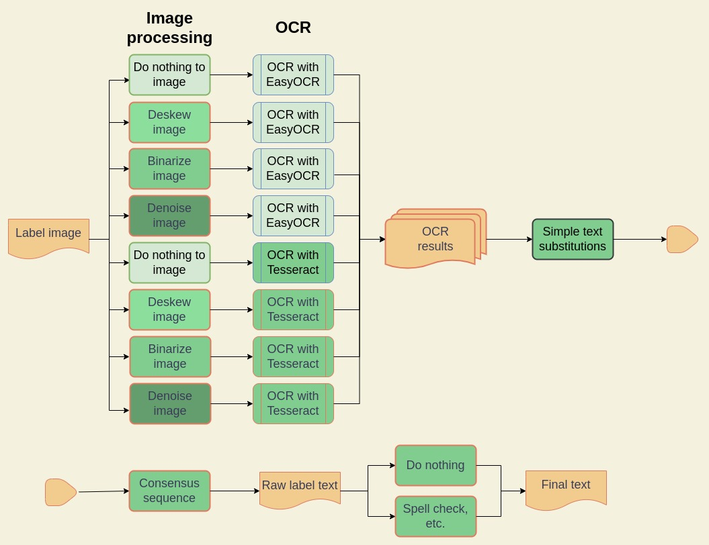

# ocr_ensemble

1. [Description](#Description)
2. [Install](#Install)
3. [OCR labels](#OCR-labels)

## Description

You're given 1,000s or 10,000s of images of labels from herbarium sheets, and you need to extract the text from them. So, you'll want to run them through an OCR engine, like Tesseract. However, some images look like they've been used as a place mat at a child's pizza party, so you'll need to do some image processing on them before running them through OCR. So many images, and you don't know which need what processing without looking at them. The solution I'm using here is to combine an ensemble of image processing techniques and OCR engines into a single "best" text extraction.

We're taking a label like this.

[](assets/label.png)

And turning it into text like this.

```
Tarleton State University Herbarium (TAC)
Aster ericoides L.
Asteraceae Heath Aster
Texas, Erath County, Stephenville. Tarleton Agricultural Center. 0.1
miles from intersection Hwy 8 and College Farm Road. Area near
stock tank. Coordinates at entrance gate: 32° 14.889N, 98° 12.602W
Upland open. Scattered.
A. Nelson
N-1289 October 20, 2006
```

## Pipeline

[](assets/ocr_flow.jpg)

### Image processing techniques

1. Do nothing to the image. This works best with clean new herbarium sheets.
2. We slightly blur the image, scale it to a size that works with many OCR images, orient the image to get it right side up, and then deskew the image to finetune its orientation.
3. We perform all the steps in #2 and additionally perform a Sauvola (Sauvola & Pietikainen, 2000) binarization of the image, which often helps improve OCR results.
4. We do all the steps in #3, then remove “snow” (image speckles) and fill in any small “holes” in the binarized image.

### OCR engines

1. Tesseract OCR (Smith 2007).
2. EasyOCR (https://github.com/JaidedAI/EasyOCR).

Each have their strengths and weaknesses.

### OCR results

There are now up to 8 possible OCR results, one for every combination of image processing technique and OCR engine. We found, by scoring against a gold standard, that using all 8 combinations does not always yield the best results. Currently, we use 6/8 combinations with binarize/EasyOCR and denoise/EasyOCR deemed unhelpful.

### Minor edits

Perform minor edits on each of the OCR results from above. These fix some common OCR errors like the addition of spaces before punctuation or common character substitutions.

### Remove bad results

Some OCR results from above may be terrible, and we will want to remove them. To do this we look for Levenshtein distance outliers.
1. We get the Levenshtein distance of every pair of OCR results.
2. Next we get the best pair, i.e. the pair with the lowest Levenshtein distance.
   1. We always keep the best 2.
3. Finally, we remove OCR results that have a Levenshtein distance greater than a cutoff from the best score. From those best two. For example, if the cutoff is 128 and the best pair had a distance of 10 then any OCR result with a score greater than 138 from either of best pair gets removed.

### Multiple sequence alignment of texts.

The next step in the workflow is to use a Multiple Sequence Alignment (MSA) algorithm that is directly analogous to the ones used for biological sequences but instead of using a PAM or BLOSUM substitution matrix we use a visual similarity matrix. Visual similarity depends on the font so an exact distance is not feasible. Instead, we use a rough similarity score that ranges from +2 for characters that are identical, to -2 where the characters are wildly different like a period and a W. We also used a gap penalty of -3 and a gap extension penalty of -0.5.

For example, if given these strings:

```
MOJAVE DESERT, PROVIDENCE MTS.: canyon above
E. MOJAVE DESERT , PROVIDENCE MTS . : canyon above
E MOJAVE DESERT PROVTDENCE MTS. # canyon above
Be ‘MOJAVE DESERT, PROVIDENCE canyon “above
```

The alignment may look like the following, depending on the MSA parameters. ⋄ is the gap character.

```
⋄⋄⋄⋄MOJAVE DESERT⋄, PROVIDENCE MTS⋄.⋄: canyon ⋄above
E⋄. MOJAVE DESERT , PROVIDENCE MTS . : canyon ⋄above
E⋄⋄ MOJAVE DESERT ⋄⋄PROVTDENCE MTS⋄. # canyon ⋄above
Be ‘MOJAVE DESERT⋄, PROVIDENCE ⋄⋄⋄⋄⋄⋄⋄⋄canyon “above
```

### Final edits

Finally, we edit the MSA consensus sequence with a spell checker, add or remove spaces within words, and fix common character substitutions caused by the alignment process.

## Install
You can install the requirements into your python environment like so:

```bash
git clone https://github.com/rafelafrance/ocr_ensemble.git
cd /path/to/ocr_ensemble
make install
```

Every time you want to run any scripts in a new terminal session you will need to activate the virtual environment, once, before running them.

```bash
cd /path/to/ocr_ensemble
source .venv/bin/activate
```

## OCR labels

```bash
ocr-labels --label-dir data/label_images_dir --text-dir /path/to/output_text_dir -RrDdbnPp
```

## Update character matrix

**TODO**
